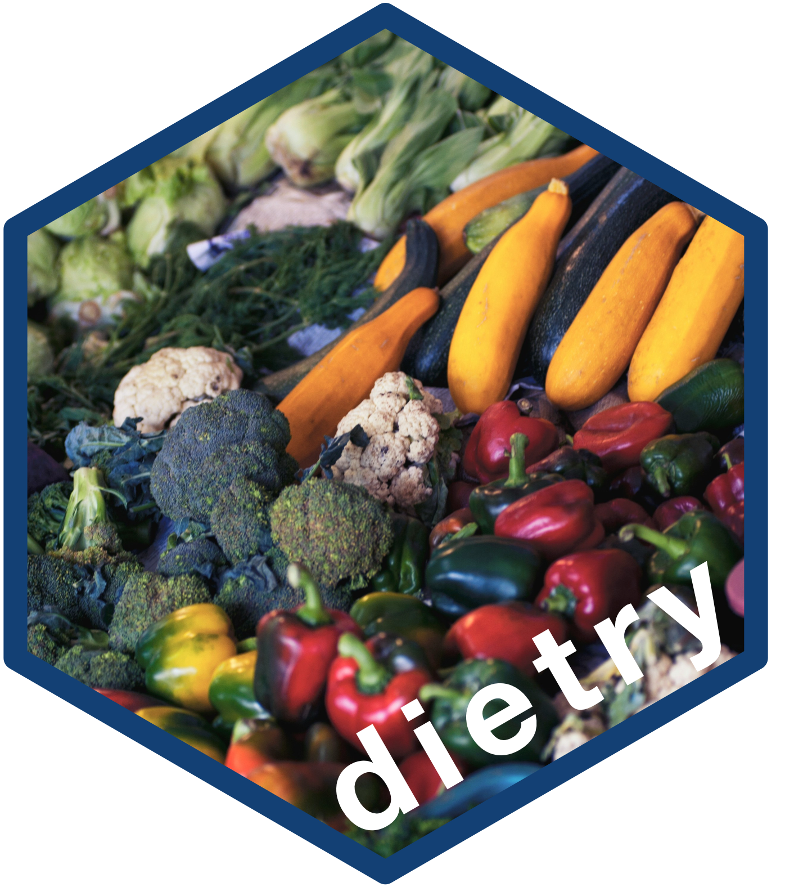

<!-- README.md is generated from README.Rmd. Please edit that file -->

```{r, include = FALSE}
knitr::opts_chunk$set(
  collapse = TRUE,
  comment = "#>",
  fig.path = "man/figures/README-",
  out.width = "100%"
)
```

# dietry: Utilities for Dietary Intake Indicators for Food Security Assessments 

<!-- badges: start -->
[](https://www.repostatus.org/#wip)
[](https://lifecycle.r-lib.org/articles/stages.html#experimental)
[](https://github.com/nutriverse/dietry/actions/workflows/R-CMD-check.yaml)
[](https://app.codecov.io/gh/nutriverse/dietry?branch=main)
[](https://www.codefactor.io/repository/github/nutriverse/dietry)
[](https://zenodo.org/badge/latestdoi/477273747)
<!-- badges: end -->

Food security assessments utilise several dietary intake indicators as proxy measures for diet quality, diet sufficiency, and food availability either at individual or household level. Utilities for recoding and calculating these indicators support in establishing consistent and reliable results.

## What does `dietry` do?

Currently, the `dietry` package has functions for:

* Cleaning, processing, scoring, and classifying the Food Consumption Score.

## Installation

The `dietry` package is still in active development and not yet available on [CRAN](https://cran.r-project.org/).

You can install the development version of `dietry` from the [nutriverse R Universe](https://nutriverse.r-universe.dev) with:

``` r
install.packages(
  "dietry", 
  repos = c('https://nutriverse.r-universe.dev', 'https://cloud.r-project.org')
)
```

## Citation

If you find the `dietry` package useful, please cite using the suggested citation provided by a call to the `citation` function as follows:

```{r cite}
citation("dietry")
```


## Community guidelines
Feedback, bug reports, and feature requests are welcome; file issues or seek support [here](https://github.com/nutriverse/dietry/issues). If you would like to contribute to the package, please see our [contributing guidelines](https://nutriverse.io/dietry/CONTRIBUTING.html).

This project is released with a [Contributor Code of Conduct](https://contributor-covenant.org/version/2/1/CODE_OF_CONDUCT.html). By contributing to this project, you agree to abide by its terms.

